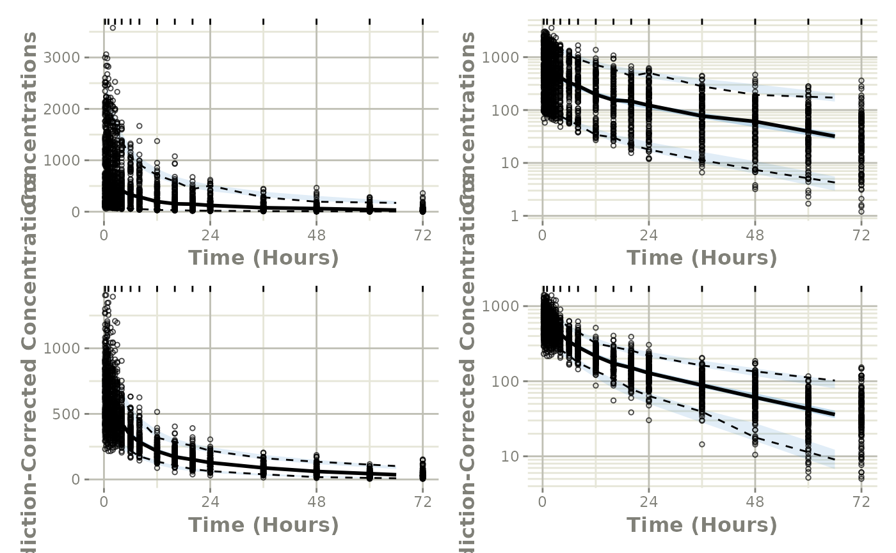

# Easily Create a VPC using nonmem2rx

This shows an easy work-flow to create a VPC using a NONMEM model:

## Step 1: Convert the `NONMEM` model to `rxode2`:

``` r

library(babelmixr2)
library(nonmem2rx)


# First we need the location of the nonmem control stream Since we are running an example, we will use one of the built-in examples in `nonmem2rx`
ctlFile <- system.file("mods/cpt/runODE032.ctl", package="nonmem2rx")
# You can use a control stream or other file. With the development
# version of `babelmixr2`, you can simply point to the listing file

mod <- nonmem2rx(ctlFile, lst=".res", save=FALSE)
#> ℹ getting information from  '/home/runner/work/_temp/Library/nonmem2rx/mods/cpt/runODE032.ctl'
#> ℹ reading in xml file
#> ℹ done
#> ℹ reading in ext file
#> ℹ done
#> ℹ reading in phi file
#> ℹ done
#> ℹ reading in lst file
#> ℹ abbreviated list parsing
#> ℹ done
#> ℹ reading in grd file
#> ℹ done
#> ℹ splitting control stream by records
#> ℹ done
#> ℹ Processing record $INPUT
#> ℹ Processing record $MODEL
#> ℹ Processing record $gTHETA
#> ℹ Processing record $OMEGA
#> ℹ Processing record $SIGMA
#> ℹ Processing record $PROBLEM
#> ℹ Processing record $DATA
#> ℹ Processing record $SUBROUTINES
#> ℹ Processing record $PK
#> ℹ Processing record $DES
#> ℹ Processing record $ERROR
#> ℹ Processing record $ESTIMATION
#> ℹ Ignore record $ESTIMATION
#> ℹ Processing record $COVARIANCE
#> ℹ Ignore record $COVARIANCE
#> ℹ Processing record $TABLE
#> ℹ change initial estimate of `theta1` to `1.37034036528946`
#> ℹ change initial estimate of `theta2` to `4.19814911033061`
#> ℹ change initial estimate of `theta3` to `1.38003493562413`
#> ℹ change initial estimate of `theta4` to `3.87657341967489`
#> ℹ change initial estimate of `theta5` to `0.196446108190896`
#> ℹ change initial estimate of `eta1` to `0.101251418415006`
#> ℹ change initial estimate of `eta2` to `0.0993872449483344`
#> ℹ change initial estimate of `eta3` to `0.101302674763154`
#> ℹ change initial estimate of `eta4` to `0.0730497519364148`
#> ℹ read in nonmem input data (for model validation): /home/runner/work/_temp/Library/nonmem2rx/mods/cpt/Bolus_2CPT.csv
#> ℹ ignoring lines that begin with a letter (IGNORE=@)
#> ℹ applying names specified by $INPUT
#> ℹ subsetting accept/ignore filters code: .data[-which((.data$SD == 0)),]
#> ℹ renaming 'ytype' to 'nmytype'
#> ℹ done
#> ℹ read in nonmem IPRED data (for model validation): /home/runner/work/_temp/Library/nonmem2rx/mods/cpt/runODE032.csv
#> ℹ done
#> ℹ changing most variables to lower case
#> ℹ done
#> ℹ replace theta names
#> ℹ done
#> ℹ replace eta names
#> ℹ done (no labels)
#> ℹ renaming compartments
#> ℹ done
#> ℹ solving ipred problem
#> ℹ done
#> ℹ solving pred problem
#> ℹ done
```

## Step 2: convert the `rxode2` model to `nlmixr2`

In this step, you convert the model to `nlmixr2` by `as.nlmixr2(mod)`;
You may need to do a [little manual work to get the residual
specification to match between nlmixr2 and NONMEM](convert-nlmixr2.md).

Once the residual specification is compatible with a nlmixr2 object, you
can convert the model, `mod`, to a nlmixr2 fit object:

``` r

fit <- as.nlmixr2(mod)
#> → loading into symengine environment...
#> → pruning branches (`if`/`else`) of full model...
#> ✔ done
#> → finding duplicate expressions in EBE model...
#> [====|====|====|====|====|====|====|====|====|====] 0:00:00
#> → optimizing duplicate expressions in EBE model...
#> [====|====|====|====|====|====|====|====|====|====] 0:00:00
#> → compiling EBE model...
#> ✔ done
#> rxode2 5.1.4 using 2 threads (see ?getRxThreads)
#>   no cache: create with `rxCreateCache()`
#> → Calculating residuals/tables
#> ✔ done

fit
```

``` math
\begin{align*}
cmt({CENTRAL}) \\
cmt({PERI}) \\
{cl} & = \exp\left({theta1}+{eta1}\right) \\
{v} & = \exp\left({theta2}+{eta2}\right) \\
{q} & = \exp\left({theta3}+{eta3}\right) \\
{v2} & = \exp\left({theta4}+{eta4}\right) \\
{v1} & = {v} \\
{scale1} & = {v} \\
{k21} & = \frac{{q}}{{v2}} \\
{k12} & = \frac{{q}}{{v}} \\
\frac{d \: CENTRAL}{dt} & = {k21} {\times} {PERI}-{k12} {\times} {CENTRAL}-\frac{{cl} {\times} {CENTRAL}}{{v1}} \\
\frac{d \: PERI}{dt} & = -{k21} {\times} {PERI}+{k12} {\times} {CENTRAL} \\
{f} & = \frac{{CENTRAL}}{{scale1}} \\
{ipred} & = {f} \\
{rescv} & = {RSV} \\
{ipred} & \sim prop({RSV})
\end{align*}
```

## Step 3: Perform the VPC

From here we simply use
[`vpcPlot()`](https://nlmixr2.github.io/nlmixr2plot/reference/vpcPlot.html)
in conjunction with the `vpc` package to get the regular and
prediction-corrected VPCs and arrange them on a single plot:

``` r


library(ggplot2)
p1 <- vpcPlot(fit, show=list(obs_dv=TRUE))
#> [====|====|====|====|====|====|====|====|====|====] 0:00:01
#> Warning in filter_dv(obs, verbose): No software packages matched for filtering values, not filtering.
#>  Object class: other, data.frame
#>  Available filters: phoenix, nonmem
#> Warning in filter_dv(sim, verbose): No software packages matched for filtering values, not filtering.
#>  Object class: other, nlmixr2vpcSim, data.frame
#>  Available filters: phoenix, nonmem

p1 <- p1 + ylab("Concentrations") +
  rxode2::rxTheme() +
  xlab("Time (hr)") +
  xgxr::xgx_scale_x_time_units("hour", "hour")
#> Scale for x is already present.
#> Adding another scale for x, which will replace the existing scale.

p1a <- p1 + xgxr::xgx_scale_y_log10()
#> Scale for y is already present.
#> Adding another scale for y, which will replace the existing scale.

## A prediction-corrected VPC
p2 <- vpcPlot(fit, pred_corr = TRUE, show=list(obs_dv=TRUE))
#> [====|====|====|====|====|====|====|====|====|====] 0:00:01
#> Warning in filter_dv(obs, verbose): No software packages matched for filtering values, not filtering.
#>  Object class: other, data.frame
#>  Available filters: phoenix, nonmem
#> Warning in filter_dv(obs, verbose): No software packages matched for filtering values, not filtering.
#>  Object class: other, nlmixr2vpcSim, data.frame
#>  Available filters: phoenix, nonmem
p2 <- p2 + ylab("Prediction-Corrected Concentrations") +
  rxode2::rxTheme() +
  xlab("Time (hr)") +
  xgxr::xgx_scale_x_time_units("hour", "hour")
#> Scale for x is already present.
#> Adding another scale for x, which will replace the existing scale.

p2a <- p2 + xgxr::xgx_scale_y_log10()
#> Scale for y is already present.
#> Adding another scale for y, which will replace the existing scale.


library(patchwork)
(p1 * p1a) / (p2 * p2a)
```


