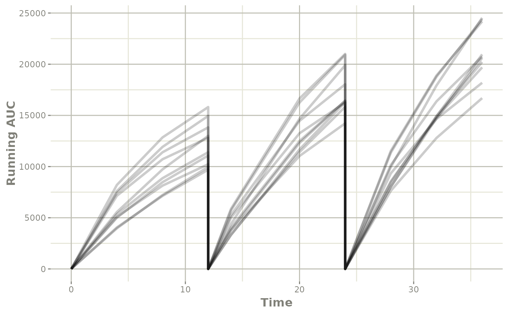

# Simulate Derived Variables from imported NONMEM model

This page shows a simple work-flow for directly simulating a different
dosing paradigm with new derived items, in this case `AUC`.

## Step 1: Import the model

``` r
library(nonmem2rx)
library(rxode2)


# First we need the location of the nonmem control stream Since we are running an example, we will use one of the built-in examples in `nonmem2rx`
ctlFile <- system.file("mods/cpt/runODE032.ctl", package="nonmem2rx")
# You can use a control stream or other file. With the development
# version of `babelmixr2`, you can simply point to the listing file

mod <- nonmem2rx(ctlFile, lst=".res", save=FALSE, determineError=FALSE)
#> ℹ getting information from  '/home/runner/work/_temp/Library/nonmem2rx/mods/cpt/runODE032.ctl'
#> ℹ reading in xml file
#> ℹ done
#> ℹ reading in ext file
#> ℹ done
#> ℹ reading in phi file
#> ℹ done
#> ℹ reading in lst file
#> ℹ abbreviated list parsing
#> ℹ done
#> ℹ reading in grd file
#> ℹ done
#> ℹ splitting control stream by records
#> ℹ done
#> ℹ Processing record $INPUT
#> ℹ Processing record $MODEL
#> ℹ Processing record $gTHETA
#> ℹ Processing record $OMEGA
#> ℹ Processing record $SIGMA
#> ℹ Processing record $PROBLEM
#> ℹ Processing record $DATA
#> ℹ Processing record $SUBROUTINES
#> ℹ Processing record $PK
#> ℹ Processing record $DES
#> ℹ Processing record $ERROR
#> ℹ Processing record $ESTIMATION
#> ℹ Ignore record $ESTIMATION
#> ℹ Processing record $COVARIANCE
#> ℹ Ignore record $COVARIANCE
#> ℹ Processing record $TABLE
#> ℹ change initial estimate of `theta1` to `1.37034036528946`
#> ℹ change initial estimate of `theta2` to `4.19814911033061`
#> ℹ change initial estimate of `theta3` to `1.38003493562413`
#> ℹ change initial estimate of `theta4` to `3.87657341967489`
#> ℹ change initial estimate of `theta5` to `0.196446108190896`
#> ℹ change initial estimate of `eta1` to `0.101251418415006`
#> ℹ change initial estimate of `eta2` to `0.0993872449483344`
#> ℹ change initial estimate of `eta3` to `0.101302674763154`
#> ℹ change initial estimate of `eta4` to `0.0730497519364148`
#> ℹ read in nonmem input data (for model validation): /home/runner/work/_temp/Library/nonmem2rx/mods/cpt/Bolus_2CPT.csv
#> ℹ ignoring lines that begin with a letter (IGNORE=@)'
#> ℹ applying names specified by $INPUT
#> ℹ subsetting accept/ignore filters code: .data[-which((.data$SD == 0)),]
#> ℹ renaming 'ytype' to 'nmytype'
#> ℹ done
#> ℹ read in nonmem IPRED data (for model validation): /home/runner/work/_temp/Library/nonmem2rx/mods/cpt/runODE032.csv
#> ℹ done
#> ℹ changing most variables to lower case
#> ℹ done
#> ℹ replace theta names
#> ℹ done
#> ℹ replace eta names
#> ℹ done (no labels)
#> ℹ renaming compartments
#> ℹ done
#> ℹ solving ipred problem
#> ℹ done
#> ℹ solving pred problem
#> ℹ done
```

## Step 2: Add AUC calculation

The concentration in this case is the `f` from the model, a trick to get
the `AUC` is to have an additional ODE `d/dt(AUC) <- f` and use some
reset to get it per dosing period.

However, this additional parameter is not part of the original model.
The calculation of AUC would depend on the number of observations in
your model, and for sparse data wouldn’t be terribly accurate.

One thing you can do is to use model piping append `d/dt(AUC) <- f` to
the imported model:

``` r
modAuc <- mod %>%
  model(d/dt(AUC) <- f, append=TRUE)
#> → significant model change detected
#> → kept in model: '$atol', '$nonmemData', '$rtol', '$ssAtol', '$ssRtol'
#> → removed from model: '$digest', '$etaData', '$file', '$ipredAtol', '$ipredCompare', '$ipredData', '$ipredRtol', '$iwresAtol', '$iwresCompare', '$iwresRtol', '$notes', '$outputExtension', '$predAtol', '$predCompare', '$predData', '$predRtol', '$sigmaNames'

modAuc
#>  ── rxode2-based free-form 3-cmt ODE model ────────────────────────────────────── 
#>  ── Initalization: ──  
#> Fixed Effects ($theta): 
#>    theta1    theta2    theta3    theta4       RSV 
#> 1.3703404 4.1981491 1.3800349 3.8765734 0.1964461 
#> 
#> Omega ($omega): 
#>           eta1       eta2      eta3       eta4
#> eta1 0.1012514 0.00000000 0.0000000 0.00000000
#> eta2 0.0000000 0.09938724 0.0000000 0.00000000
#> eta3 0.0000000 0.00000000 0.1013027 0.00000000
#> eta4 0.0000000 0.00000000 0.0000000 0.07304975
#> 
#> States ($state or $stateDf): 
#>   Compartment Number Compartment Name
#> 1                  1          CENTRAL
#> 2                  2             PERI
#> 3                  3              AUC
#>  ── μ-referencing ($muRefTable): ──  
#>    theta  eta level
#> 1 theta1 eta1    id
#> 2 theta2 eta2    id
#> 3 theta3 eta3    id
#> 4 theta4 eta4    id
#> 
#>  ── Model (Normalized Syntax): ── 
#> function() {
#>     description <- "BOLUS_2CPT_CLV1QV2 SINGLE DOSE FOCEI (120 Ind/2280 Obs) runODE032"
#>     dfObs <- 2280
#>     dfSub <- 120
#>     sigma <- lotri({
#>         eps1 ~ 1
#>     })
#>     thetaMat <- lotri({
#>         theta1 ~ c(theta1 = 0.000887681)
#>         theta2 ~ c(theta1 = -0.00010551, theta2 = 0.000871409)
#>         theta3 ~ c(theta1 = 0.000184416, theta2 = -0.000106195, 
#>             theta3 = 0.00299336)
#>         theta4 ~ c(theta1 = -0.000120234, theta2 = -5.06663e-05, 
#>             theta3 = 0.000165252, theta4 = 0.00121347)
#>         RSV ~ c(theta1 = 5.2783e-08, theta2 = -1.56562e-05, theta3 = 5.99331e-06, 
#>             theta4 = -2.53991e-05, RSV = 9.94218e-06)
#>         eps1 ~ c(theta1 = 0, theta2 = 0, theta3 = 0, theta4 = 0, 
#>             RSV = 0, eps1 = 0)
#>         eta1 ~ c(theta1 = -4.71273e-05, theta2 = 4.69667e-05, 
#>             theta3 = -3.64271e-05, theta4 = 2.54796e-05, RSV = -8.16885e-06, 
#>             eps1 = 0, eta1 = 0.000169296)
#>         omega.2.1 ~ c(theta1 = 0, theta2 = 0, theta3 = 0, theta4 = 0, 
#>             RSV = 0, eps1 = 0, eta1 = 0, omega.2.1 = 0)
#>         eta2 ~ c(theta1 = -7.37156e-05, theta2 = 2.56634e-05, 
#>             theta3 = -8.08349e-05, theta4 = 1.37e-05, RSV = -4.36564e-06, 
#>             eps1 = 0, eta1 = 8.75181e-06, omega.2.1 = 0, eta2 = 0.00015125)
#>         omega.3.1 ~ c(theta1 = 0, theta2 = 0, theta3 = 0, theta4 = 0, 
#>             RSV = 0, eps1 = 0, eta1 = 0, omega.2.1 = 0, eta2 = 0, 
#>             omega.3.1 = 0)
#>         omega.3.2 ~ c(theta1 = 0, theta2 = 0, theta3 = 0, theta4 = 0, 
#>             RSV = 0, eps1 = 0, eta1 = 0, omega.2.1 = 0, eta2 = 0, 
#>             omega.3.1 = 0, omega.3.2 = 0)
#>         eta3 ~ c(theta1 = 6.63383e-05, theta2 = -8.19002e-05, 
#>             theta3 = 0.000548985, theta4 = 0.000168356, RSV = 1.59122e-06, 
#>             eps1 = 0, eta1 = 3.48714e-05, omega.2.1 = 0, eta2 = 4.31593e-07, 
#>             omega.3.1 = 0, omega.3.2 = 0, eta3 = 0.000959029)
#>         omega.4.1 ~ c(theta1 = 0, theta2 = 0, theta3 = 0, theta4 = 0, 
#>             RSV = 0, eps1 = 0, eta1 = 0, omega.2.1 = 0, eta2 = 0, 
#>             omega.3.1 = 0, omega.3.2 = 0, eta3 = 0, omega.4.1 = 0)
#>         omega.4.2 ~ c(theta1 = 0, theta2 = 0, theta3 = 0, theta4 = 0, 
#>             RSV = 0, eps1 = 0, eta1 = 0, omega.2.1 = 0, eta2 = 0, 
#>             omega.3.1 = 0, omega.3.2 = 0, eta3 = 0, omega.4.1 = 0, 
#>             omega.4.2 = 0)
#>         omega.4.3 ~ c(theta1 = 0, theta2 = 0, theta3 = 0, theta4 = 0, 
#>             RSV = 0, eps1 = 0, eta1 = 0, omega.2.1 = 0, eta2 = 0, 
#>             omega.3.1 = 0, omega.3.2 = 0, eta3 = 0, omega.4.1 = 0, 
#>             omega.4.2 = 0, omega.4.3 = 0)
#>         eta4 ~ c(theta1 = -9.49661e-06, theta2 = 0.000110108, 
#>             theta3 = -0.000306537, theta4 = -9.12897e-05, RSV = 3.1877e-06, 
#>             eps1 = 0, eta1 = 1.36628e-05, omega.2.1 = 0, eta2 = -1.95096e-05, 
#>             omega.3.1 = 0, omega.3.2 = 0, eta3 = -0.00012977, 
#>             omega.4.1 = 0, omega.4.2 = 0, omega.4.3 = 0, eta4 = 0.00051019)
#>     })
#>     validation <- c("IPRED relative difference compared to Nonmem IPRED: 0%; 95% percentile: (0%,0%); rtol=6.43e-06", 
#>         "IPRED absolute difference compared to Nonmem IPRED: 95% percentile: (2.19e-05, 0.0418); atol=0.00167", 
#>         "IWRES relative difference compared to Nonmem IWRES: 0%; 95% percentile: (0%,0.01%); rtol=8.99e-06", 
#>         "IWRES absolute difference compared to Nonmem IWRES: 95% percentile: (1.82e-07, 4.63e-05); atol=3.65e-06", 
#>         "PRED relative difference compared to Nonmem PRED: 0%; 95% percentile: (0%,0%); rtol=6.41e-06", 
#>         "PRED absolute difference compared to Nonmem PRED: 95% percentile: (1.41e-07,0.00382) atol=6.41e-06")
#>     ini({
#>         theta1 <- 1.37034036528946
#>         label("log Cl")
#>         theta2 <- 4.19814911033061
#>         label("log Vc")
#>         theta3 <- 1.38003493562413
#>         label("log Q")
#>         theta4 <- 3.87657341967489
#>         label("log Vp")
#>         RSV <- c(0, 0.196446108190896, 1)
#>         label("RSV")
#>         eta1 ~ 0.101251418415006
#>         eta2 ~ 0.0993872449483344
#>         eta3 ~ 0.101302674763154
#>         eta4 ~ 0.0730497519364148
#>     })
#>     model({
#>         cmt(CENTRAL)
#>         cmt(PERI)
#>         cl <- exp(theta1 + eta1)
#>         v <- exp(theta2 + eta2)
#>         q <- exp(theta3 + eta3)
#>         v2 <- exp(theta4 + eta4)
#>         v1 <- v
#>         scale1 <- v
#>         k21 <- q/v2
#>         k12 <- q/v
#>         d/dt(CENTRAL) <- k21 * PERI - k12 * CENTRAL - cl * CENTRAL/v1
#>         d/dt(PERI) <- -k21 * PERI + k12 * CENTRAL
#>         f <- CENTRAL/scale1
#>         ipred <- f
#>         rescv <- RSV
#>         w <- ipred * rescv
#>         ires <- DV - ipred
#>         iwres <- ires/w
#>         y <- ipred + w * eps1
#>         d/dt(AUC) <- f
#>     })
#> }
#>  ── nonmem2rx extra properties: ──  
#> 
#> Sigma ($sigma): 
#>      eps1
#> eps1    1
#> 
#> other properties include: $nonmemData
#> captured NONMEM table outputs: 
#> NONMEM/rxode2 comparison data: $iwresCompare, $predCompare, $ipredCompare
#> NONMEM/rxode2 composite comparison: $predAtol, $predRtol, $ipredAtol, $ipredRtol, $iwresAtol, $iwresRtol
```

You can also use `append=NA` to pre-pend or `append=f` to put the ODE
right after the `f` line in the model.

## Step 3: Setup event table to calculate the AUC for a different dosing paradigm:

Lets say that in this case instead of a single dose, we want to see what
the concentration profile is with a single day of BID dosing. In this
case is done by creating a [quick event
table](https://nlmixr2.github.io/rxode2/articles/rxode2-event-table.html).

In this case since we are also wanting `AUC` per dosing period, you can
add a reset dose to the `AUC` compartment every time a dose is given (so
it will only track the AUC of the current dose):

``` r
ev <- et(amt=120000, ii=12, until=24) %>%
  et(amt=0, ii=12, until=24, cmt="AUC", evid=5) %>% # replace AUC with zero at dosing
  et(c(0, 4, 8, 11.999, 12, 12.01, 14, 20, 23.999, 24, 24.001, 28, 32, 36)) %>%
  et(id=1:10)
```

## Step 4: Solve using `rxode2`

In this step, we solve the model with the new event table for the 10
subjects:

``` r
s <- rxSolve(modAuc, ev)
#> ℹ using nocb interpolation like NONMEM, specify directly to change
#> ℹ using addlKeepsCov=TRUE like NONMEM, specify directly to change
#> ℹ using addlDropSs=TRUE like NONMEM, specify directly to change
#> ℹ using ssAtDoseTime=TRUE like NONMEM, specify directly to change
#> ℹ using safeZero=FALSE since NONMEM does not use protection by default
#> ℹ using safePow=FALSE since NONMEM does not use protection by default
#> ℹ using safeLog=FALSE since NONMEM does not use protection by default
#> ℹ using ss2cancelAllPending=FALSE since NONMEM does not cancel pending doses with SS=2
#> ℹ using sigma from NONMEM
#> ℹ using NONMEM specified atol=1e-12
#> ℹ using NONMEM specified rtol=1e-06
#> ℹ using NONMEM specified ssAtol=1e-12
```

Note that since this derived from a `nonmem2rx` model, the default
solving will match the tolerances and methods specified in your `NONMEM`
model.

## Step 5: Exploring the simulation (by plotting), and summarizing (dplyr)

This solved object acts the same as any other `rxode2` solved object, so
you can use the [`plot()`](https://rdrr.io/r/graphics/plot.default.html)
function to see the individual running AUC profiles you simulated:

``` r
library(ggplot2)
plot(s, AUC) +
  ylab("Running AUC")
```



You can also select the points near the dosing to get the AUC for the
interval:

``` r
library(dplyr)
#> 
#> Attaching package: 'dplyr'
#> The following objects are masked from 'package:data.table':
#> 
#>     between, first, last
#> The following objects are masked from 'package:stats':
#> 
#>     filter, lag
#> The following objects are masked from 'package:base':
#> 
#>     intersect, setdiff, setequal, union
s %>% filter(time %in% c(11.999,  23.999)) %>%
  mutate(time=round(time)) %>%
  select(id, time, AUC)
#>    id time       AUC
#> 1   1   12 14933.285
#> 2   1   24 20692.082
#> 3   2   12 11099.596
#> 4   2   24 16694.837
#> 5   3   12 10303.763
#> 6   3   24 14196.023
#> 7   4   12 13015.708
#> 8   4   24 21400.784
#> 9   5   12 11612.369
#> 10  5   24 17944.491
#> 11  6   12 10137.247
#> 12  6   24 15223.973
#> 13  7   12 16532.019
#> 14  7   24 22787.019
#> 15  8   12 10612.266
#> 16  8   24 16781.396
#> 17  9   12 11593.421
#> 18  9   24 17713.529
#> 19 10   12  7972.637
#> 20 10   24 13225.795
```
