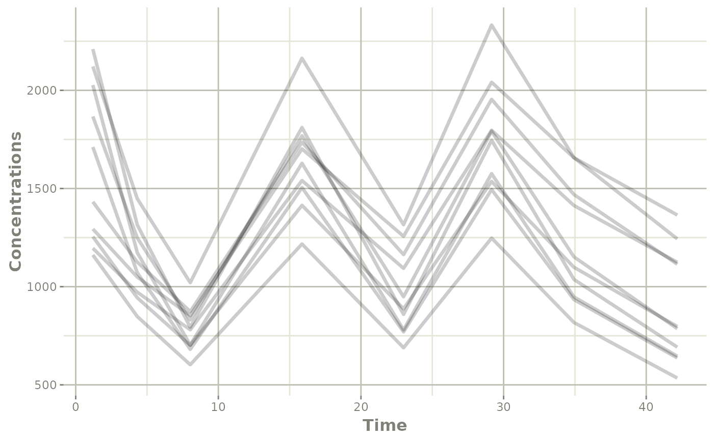

# Simulate New dosing from NONMEM model

This page shows a simple work-flow for directly simulating a different
dosing paradigm than what was modeled.

## Step 1: Import the model

``` r
library(nonmem2rx)
library(rxode2)

library(nonmem2rx)

# First we need the location of the nonmem control stream Since we are running an example, we will use one of the built-in examples in `nonmem2rx`
ctlFile <- system.file("mods/cpt/runODE032.ctl", package="nonmem2rx")
# You can use a control stream or other file. With the development
# version of `babelmixr2`, you can simply point to the listing file

mod <- nonmem2rx(ctlFile, lst=".res", save=FALSE, determineError=FALSE)
#> ℹ getting information from  '/home/runner/work/_temp/Library/nonmem2rx/mods/cpt/runODE032.ctl'
#> ℹ reading in xml file
#> ℹ done
#> ℹ reading in ext file
#> ℹ done
#> ℹ reading in phi file
#> ℹ done
#> ℹ reading in lst file
#> ℹ abbreviated list parsing
#> ℹ done
#> ℹ reading in grd file
#> ℹ done
#> ℹ splitting control stream by records
#> ℹ done
#> ℹ Processing record $INPUT
#> ℹ Processing record $MODEL
#> ℹ Processing record $gTHETA
#> ℹ Processing record $OMEGA
#> ℹ Processing record $SIGMA
#> ℹ Processing record $PROBLEM
#> ℹ Processing record $DATA
#> ℹ Processing record $SUBROUTINES
#> ℹ Processing record $PK
#> ℹ Processing record $DES
#> ℹ Processing record $ERROR
#> ℹ Processing record $ESTIMATION
#> ℹ Ignore record $ESTIMATION
#> ℹ Processing record $COVARIANCE
#> ℹ Ignore record $COVARIANCE
#> ℹ Processing record $TABLE
#> ℹ change initial estimate of `theta1` to `1.37034036528946`
#> ℹ change initial estimate of `theta2` to `4.19814911033061`
#> ℹ change initial estimate of `theta3` to `1.38003493562413`
#> ℹ change initial estimate of `theta4` to `3.87657341967489`
#> ℹ change initial estimate of `theta5` to `0.196446108190896`
#> ℹ change initial estimate of `eta1` to `0.101251418415006`
#> ℹ change initial estimate of `eta2` to `0.0993872449483344`
#> ℹ change initial estimate of `eta3` to `0.101302674763154`
#> ℹ change initial estimate of `eta4` to `0.0730497519364148`
#> ℹ read in nonmem input data (for model validation): /home/runner/work/_temp/Library/nonmem2rx/mods/cpt/Bolus_2CPT.csv
#> ℹ ignoring lines that begin with a letter (IGNORE=@)'
#> ℹ applying names specified by $INPUT
#> ℹ subsetting accept/ignore filters code: .data[-which((.data$SD == 0)),]
#> ℹ renaming 'ytype' to 'nmytype'
#> ℹ done
#> ℹ read in nonmem IPRED data (for model validation): /home/runner/work/_temp/Library/nonmem2rx/mods/cpt/runODE032.csv
#> ℹ done
#> ℹ changing most variables to lower case
#> ℹ done
#> ℹ replace theta names
#> ℹ done
#> ℹ replace eta names
#> ℹ done (no labels)
#> ℹ renaming compartments
#> ℹ done
#> ℹ solving ipred problem
#> ℹ done
#> ℹ solving pred problem
#> ℹ done
```

## Step 2: Look at a different dosing paradigm

Lets say that in this case instead of a single dose, we want to see what
the concentration profile is with a single day of BID dosing. In this
case is done by creating a [quick event
table](https://nlmixr2.github.io/rxode2/articles/rxode2-event-table.html):

``` r
ev <- et(amt=120000, ii=12, until=24) %>%
  et(list(c(0, 2), # add observations in windows
          c(4, 6),
          c(8, 12),
          c(14, 18),
          c(20, 26),
          c(28, 32),
          c(32, 36),
          c(36, 44))) %>%
  et(id=1:10)
```

## Step 3: solve using `rxode2`

In this step, we solve the model with the new event table for the 10
subjects:

``` r
s <- rxSolve(mod, ev)
#> ℹ using nocb interpolation like NONMEM, specify directly to change
#> ℹ using addlKeepsCov=TRUE like NONMEM, specify directly to change
#> ℹ using addlDropSs=TRUE like NONMEM, specify directly to change
#> ℹ using ssAtDoseTime=TRUE like NONMEM, specify directly to change
#> ℹ using safeZero=FALSE since NONMEM does not use protection by default
#> ℹ using safePow=FALSE since NONMEM does not use protection by default
#> ℹ using safeLog=FALSE since NONMEM does not use protection by default
#> ℹ using ss2cancelAllPending=FALSE since NONMEM does not cancel pending doses with SS=2
#> ℹ using sigma from NONMEM
#> ℹ using NONMEM specified atol=1e-12
#> ℹ using NONMEM specified rtol=1e-06
#> ℹ using NONMEM specified ssAtol=1e-12
```

Note that since this is a `nonmem2rx` model, the default solving will
match the tolerances and methods specified in your `NONMEM` model.

## Step 4: exploring the simulation (by plotting)

This solved object acts the same as any other `rxode2` solved object, so
you can use the [`plot()`](https://rdrr.io/r/graphics/plot.default.html)
function to see the individual profiles you simulated:

``` r
library(ggplot2)
plot(s, ipred) +
  ylab("Concentrations")
```


