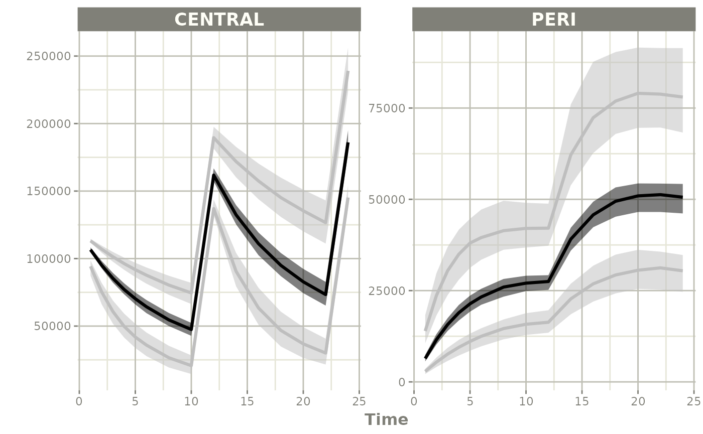
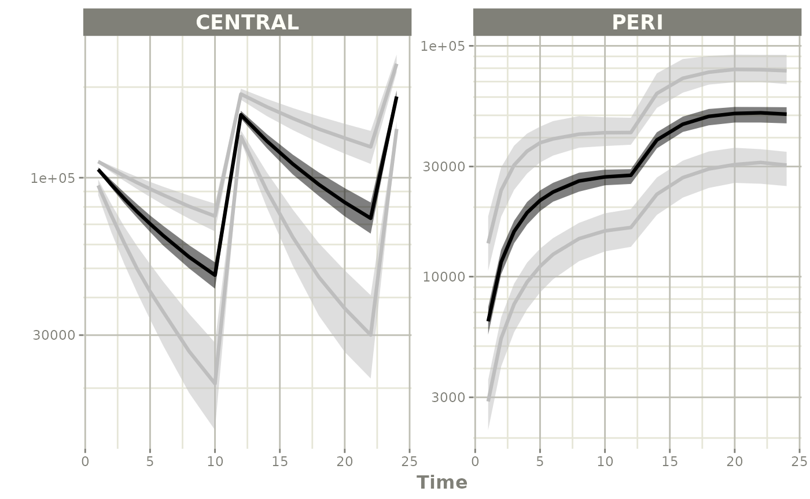

# Simulate using Parameter Uncertainty

This page shows a simple work-flow for directly simulating a different
dosing paradigm than what was modeled taking into account the modeled
uncertainty. This workflow is very similar to simply [simulating without
uncertainty](simulate-new-dosing.md) in the parameters themselves.

## Step 1: Import the model

``` r
library(nonmem2rx)
library(rxode2)
# its best practice to set the seed for the simulations
set.seed(42)
rxSetSeed(42)

# First we need the location of the nonmem control stream Since we are
# running an example, we will use one of the built-in examples in
# `nonmem2rx`
ctlFile <- system.file("mods/cpt/runODE032.ctl", package="nonmem2rx")
# You can use a control stream or other file. With the development
# version of `babelmixr2`, you can simply point to the listing file
mod <- nonmem2rx(ctlFile, lst=".res", save=FALSE, determineError=FALSE)
#> ℹ getting information from  '/home/runner/work/_temp/Library/nonmem2rx/mods/cpt/runODE032.ctl'
#> ℹ reading in xml file
#> ℹ done
#> ℹ reading in ext file
#> ℹ done
#> ℹ reading in phi file
#> ℹ done
#> ℹ reading in lst file
#> ℹ abbreviated list parsing
#> ℹ done
#> ℹ reading in grd file
#> ℹ done
#> ℹ splitting control stream by records
#> ℹ done
#> ℹ Processing record $INPUT
#> ℹ Processing record $MODEL
#> ℹ Processing record $gTHETA
#> ℹ Processing record $OMEGA
#> ℹ Processing record $SIGMA
#> ℹ Processing record $PROBLEM
#> ℹ Processing record $DATA
#> ℹ Processing record $SUBROUTINES
#> ℹ Processing record $PK
#> ℹ Processing record $DES
#> ℹ Processing record $ERROR
#> ℹ Processing record $ESTIMATION
#> ℹ Ignore record $ESTIMATION
#> ℹ Processing record $COVARIANCE
#> ℹ Ignore record $COVARIANCE
#> ℹ Processing record $TABLE
#> ℹ change initial estimate of `theta1` to `1.37034036528946`
#> ℹ change initial estimate of `theta2` to `4.19814911033061`
#> ℹ change initial estimate of `theta3` to `1.38003493562413`
#> ℹ change initial estimate of `theta4` to `3.87657341967489`
#> ℹ change initial estimate of `theta5` to `0.196446108190896`
#> ℹ change initial estimate of `eta1` to `0.101251418415006`
#> ℹ change initial estimate of `eta2` to `0.0993872449483344`
#> ℹ change initial estimate of `eta3` to `0.101302674763154`
#> ℹ change initial estimate of `eta4` to `0.0730497519364148`
#> ℹ read in nonmem input data (for model validation): /home/runner/work/_temp/Library/nonmem2rx/mods/cpt/Bolus_2CPT.csv
#> ℹ ignoring lines that begin with a letter (IGNORE=@)'
#> ℹ applying names specified by $INPUT
#> ℹ subsetting accept/ignore filters code: .data[-which((.data$SD == 0)),]
#> ℹ renaming 'ytype' to 'nmytype'
#> ℹ done
#> ℹ read in nonmem IPRED data (for model validation): /home/runner/work/_temp/Library/nonmem2rx/mods/cpt/runODE032.csv
#> ℹ done
#> ℹ changing most variables to lower case
#> ℹ done
#> ℹ replace theta names
#> ℹ done
#> ℹ replace eta names
#> ℹ done (no labels)
#> ℹ renaming compartments
#> ℹ done
#> ℹ solving ipred problem
#> ℹ done
#> ℹ solving pred problem
#> ℹ done
```

## Step 2: Look at a different dosing paradigm

Lets say that in this case instead of a single dose, we want to see what
the concentration profile is with a single day of BID dosing. In this
case is done by creating a [quick event
table](https://nlmixr2.github.io/rxode2/articles/rxode2-event-table.html).

``` r
ev <- et(amt=120000, ii=12, until=24) %>%
  et(c(1:6, seq(8, 24, by=2))) %>%
  et(id=1:100)
```

## Step 3: Solve using the uncertainty in the NONMEM model

To use the uncertainty in the model, it is a simple matter of telling
how many times
[`rxode2()`](https://nlmixr2.github.io/rxode2/reference/rxode2.html)
should sample with `nStud=X`. In this case we will use `100`.

``` r
s <- rxSolve(mod, ev, nStud=100)
#> ℹ using nocb interpolation like NONMEM, specify directly to change
#> ℹ using addlKeepsCov=TRUE like NONMEM, specify directly to change
#> ℹ using addlDropSs=TRUE like NONMEM, specify directly to change
#> ℹ using ssAtDoseTime=TRUE like NONMEM, specify directly to change
#> ℹ using safeZero=FALSE since NONMEM does not use protection by default
#> ℹ using safePow=FALSE since NONMEM does not use protection by default
#> ℹ using safeLog=FALSE since NONMEM does not use protection by default
#> ℹ using ss2cancelAllPending=FALSE since NONMEM does not cancel pending doses with SS=2
#> ℹ using dfSub=120 from NONMEM
#> ℹ using dfObs=2280 from NONMEM
#> ℹ using thetaMat from NONMEM
#> ℹ using sigma from NONMEM
#> ℹ using NONMEM specified atol=1e-12
#> ℹ using NONMEM specified rtol=1e-06
#> ℹ using NONMEM specified ssAtol=1e-12
#> ℹ thetaMat has too many items, ignored: 'omega.2.1', 'omega.3.1', 'omega.3.2', 'omega.4.1', 'omega.4.2', 'omega.4.3'
#> ℹ thetaMat has zero diagonal items, ignored: 'eps1'
#> [====|====|====|====|====|====|====|====|====|====] 0:00:01

s
#> ── Solved rxode2 object ──
#> ── Parameters (x$params): ──
#> # A tibble: 10,000 × 11
#>    sim.id id    theta1 theta2 theta3 theta4   RSV    eta1     eta2      eta3
#>     <int> <fct>  <dbl>  <dbl>  <dbl>  <dbl> <dbl>   <dbl>    <dbl>     <dbl>
#>  1      1 1       1.34   4.14   1.34   3.88 0.197 -0.177  -0.0490   0.354   
#>  2      1 2       1.34   4.14   1.34   3.88 0.197  0.300  -0.175   -0.000835
#>  3      1 3       1.34   4.14   1.34   3.88 0.197  0.512   0.543    0.0679  
#>  4      1 4       1.34   4.14   1.34   3.88 0.197 -0.0557 -0.225    0.464   
#>  5      1 5       1.34   4.14   1.34   3.88 0.197  0.0727  0.717   -0.0169  
#>  6      1 6       1.34   4.14   1.34   3.88 0.197 -0.0835 -0.221    0.510   
#>  7      1 7       1.34   4.14   1.34   3.88 0.197  0.721  -0.147    0.306   
#>  8      1 8       1.34   4.14   1.34   3.88 0.197  0.336   0.00156  0.287   
#>  9      1 9       1.34   4.14   1.34   3.88 0.197  0.240  -0.00161 -0.246   
#> 10      1 10      1.34   4.14   1.34   3.88 0.197  0.368  -0.178    0.171   
#> # ℹ 9,990 more rows
#> # ℹ 1 more variable: eta4 <dbl>
#> ── Initial Conditions (x$inits): ──
#> CENTRAL    PERI 
#>       0       0 
#> 
#> Simulation with uncertainty in:
#> • parameters (x$thetaMat for changes)
#> • omega matrix (x$omegaList)
#> • sigma matrix (x$sigmaList)
#> 
#> ── First part of data (object): ──
#> # A tibble: 150,000 × 21
#>   sim.id    id  time    cl     v     q    v2    v1 scale1   k21    k12     f
#>    <int> <int> <dbl> <dbl> <dbl> <dbl> <dbl> <dbl>  <dbl> <dbl>  <dbl> <dbl>
#> 1      1     1     1  3.21  59.9  5.41  31.1  59.9   59.9 0.174 0.0904 1749.
#> 2      1     1     2  3.21  59.9  5.41  31.1  59.9   59.9 0.174 0.0904 1549.
#> 3      1     1     3  3.21  59.9  5.41  31.1  59.9   59.9 0.174 0.0904 1391.
#> 4      1     1     4  3.21  59.9  5.41  31.1  59.9   59.9 0.174 0.0904 1265.
#> 5      1     1     5  3.21  59.9  5.41  31.1  59.9   59.9 0.174 0.0904 1164.
#> 6      1     1     6  3.21  59.9  5.41  31.1  59.9   59.9 0.174 0.0904 1081.
#> # ℹ 149,994 more rows
#> # ℹ 9 more variables: ipred <dbl>, rescv <dbl>, w <dbl>, ires <dbl>,
#> #   iwres <dbl>, y <dbl>, CENTRAL <dbl>, PERI <dbl>, DV <dbl>
```

## Step 4: Summarize and plot

Since there is a bunch of data, a confidence band of the simulation with
uncertainty would be helpful.

One way to do that is to select the interesting components, create a
confidence interval and then plot the confidence bands:

``` r
sci <- confint(s, parm=c("CENTRAL", "PERI", "sim"))
#> summarizing data...done

sci
#> # A tibble: 90 × 7
#>        p1  time trt        p2.5     p50   p97.5 Percentile
#>     <dbl> <dbl> <fct>     <dbl>   <dbl>   <dbl> <fct>     
#>  1 0.0250     1 CENTRAL  89088.  93122.  97785. 2.5%      
#>  2 0.5        1 CENTRAL 104763. 106382. 107850. 50%       
#>  3 0.975      1 CENTRAL 111628. 113213. 114778. 97.5%     
#>  4 0.0250     2 CENTRAL  67932.  73356.  80896. 2.5%      
#>  5 0.5        2 CENTRAL  91994.  94928.  97428. 50%       
#>  6 0.975      2 CENTRAL 104126. 107042. 109995. 97.5%     
#>  7 0.0250     3 CENTRAL  52547.  59414.  67509. 2.5%      
#>  8 0.5        3 CENTRAL  81661.  85156.  88600. 50%       
#>  9 0.975      3 CENTRAL  97288. 101479. 105605. 97.5%     
#> 10 0.0250     4 CENTRAL  41353.  48409.  57328. 2.5%      
#> # ℹ 80 more rows

plot(sci)
#> Warning: `aes_string()` was deprecated in ggplot2 3.0.0.
#> ℹ Please use tidy evaluation idioms with `aes()`.
#> ℹ See also `vignette("ggplot2-in-packages")` for more information.
#> ℹ The deprecated feature was likely used in the rxode2 package.
#>   Please report the issue at <https://github.com/nlmixr2/rxode2/issues/>.
#> This warning is displayed once per session.
#> Call `lifecycle::last_lifecycle_warnings()` to see where this warning was
#> generated.
```



``` r

plot(sci, log="y")
```


