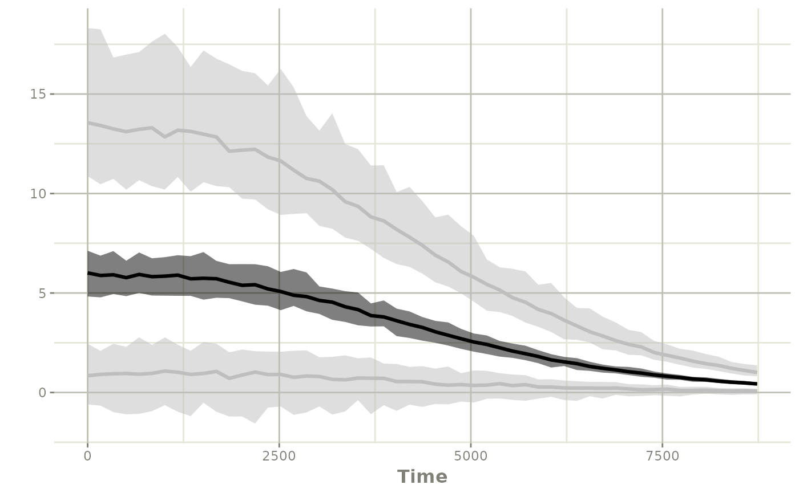
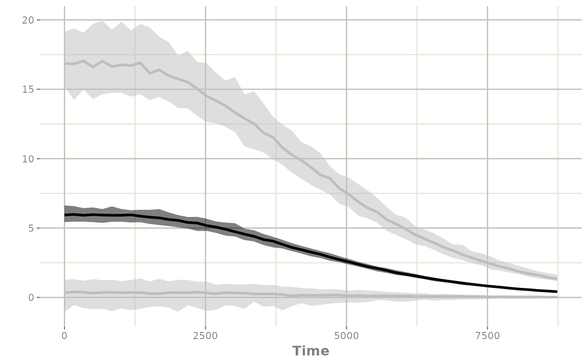

# Simulate New dosing with covariates

## Simulation with covariates or input parameters

Sometimes your NONMEM model can have covariates that you may wish to
simulate from; this simulation exercise shows a few methods to simulate
with the covariates from NONMEM.

``` r
library(nonmem2rx)
library(rxode2)
```

## Step 0: input the model

In this case, we will use the Friberg myelosuppresion model originally
contributed as an example by Yuan Xiong.

With the simulated data in nlmixr2, babelmixr2, and some manual edits to
simplify the model we run NONMEM 7.4.3.

Note in this case there are some PK parameters that are in the model
that require some special handling to simulate with uncertainty or even
with different dosing scenarios.

For any simulation scenario, we need to import the NONMEM model:

``` r
# Since this is an included example, we import the model from the
# `nonmem2rx` package.  This is done by the `system.file()` command:
wbcModel <- system.file("wbc/wbc.lst", package="nonmem2rx")

wbc <- nonmem2rx(wbcModel)
#> ℹ getting information from  '/home/runner/work/_temp/Library/nonmem2rx/wbc/wbc.lst'
#> ℹ reading in xml file
#> ℹ done
#> ℹ reading in ext file
#> ℹ done
#> ℹ reading in phi file
#> ℹ done
#> ℹ reading in lst file
#> ℹ abbreviated list parsing
#> ℹ done
#> ℹ reading in grd file
#> ℹ done
#> ℹ splitting control stream by records
#> ℹ done
#> ℹ Processing record $INPUT
#> ℹ Processing record $MODEL
#> ℹ Processing record $gTHETA
#> ℹ Processing record $OMEGA
#> ℹ Processing record $SIGMA
#> ℹ Processing record $PROBLEM
#> ℹ Processing record $DATA
#> ℹ Processing record $SUBROUTINES
#> ℹ Processing record $PK
#> ℹ Processing record $DES
#> ℹ Processing record $ERROR
#> ℹ Processing record $ESTIMATION
#> ℹ Ignore record $ESTIMATION
#> ℹ Processing record $COVARIANCE
#> ℹ Ignore record $COVARIANCE
#> ℹ Processing record $TABLE
#> ℹ change initial estimate of `theta1` to `1.83169895537931`
#> ℹ change initial estimate of `theta2` to `8.37329670479077`
#> ℹ change initial estimate of `theta3` to `6.37739634773425`
#> ℹ change initial estimate of `theta4` to `-11.558011558`
#> ℹ change initial estimate of `theta5` to `0.464650000001741`
#> ℹ change initial estimate of `eta1` to `0.0979049999946534`
#> ℹ change initial estimate of `eta2` to `2.99999999999372e-06`
#> ℹ change initial estimate of `eta3` to `1.99999999999944e-05`
#> ℹ read in nonmem input data (for model validation): /home/runner/work/_temp/Library/nonmem2rx/wbc/wbc.csv
#> ℹ ignoring lines that begin with a letter (IGNORE=@)'
#> ℹ applying names specified by $INPUT
#> ℹ renaming 'ytype' to 'nmytype'
#> ℹ done
#> ℹ read in nonmem IPRED data (for model validation): /home/runner/work/_temp/Library/nonmem2rx/wbc/wbc.pred
#> ℹ done
#> ℹ read in nonmem ETA data (for model validation): /home/runner/work/_temp/Library/nonmem2rx/wbc/wbc.eta
#> ℹ done
#> ℹ changing most variables to lower case
#> ℹ done
#> ℹ replace theta names
#> ℹ done
#> ℹ replace eta names
#> ℹ done
#> ℹ renaming compartments
#> ℹ done
#> ℹ solving ipred problem
#> ℹ done
#> ℹ solving pred problem
#> ℹ done

print(wbc)
#>  ── rxode2-based free-form 7-cmt ODE model ────────────────────────────────────── 
#>  ── Initalization: ──  
#> Fixed Effects ($theta): 
#>  log_CIRC0    log_MTT  log_SLOPU  log_GAMMA   prop.err 
#>   1.831699   8.373297   6.377396 -11.558012   0.464650 
#> 
#> Omega ($omega): 
#>           eta.CIRC0 eta.MTT eta.SLOPU
#> eta.CIRC0  0.097905   0e+00     0e+00
#> eta.MTT    0.000000   3e-06     0e+00
#> eta.SLOPU  0.000000   0e+00     2e-05
#> 
#> States ($state or $stateDf): 
#>   Compartment Number Compartment Name
#> 1                  1            CENTR
#> 2                  2           PERIPH
#> 3                  3             PROL
#> 4                  4              TR1
#> 5                  5              TR2
#> 6                  6              TR3
#> 7                  7           c.CIRC
#>  ── Model (Normalized Syntax): ── 
#> function() {
#>     description <- "wbc"
#>     dfObs <- 176
#>     dfSub <- 45
#>     sigma <- lotri({
#>         eps1 ~ 1
#>     })
#>     thetaMat <- lotri({
#>         log_CIRC0 ~ c(log_CIRC0 = 0.00339803)
#>         log_MTT ~ c(log_CIRC0 = -0.00171728, log_MTT = 0.00224653)
#>         log_SLOPU ~ c(log_CIRC0 = -0.00142939, log_MTT = 0.00545118, 
#>             log_SLOPU = 0.0311551)
#>         log_GAMMA ~ c(log_CIRC0 = 0.0107932, log_MTT = -0.0333153, 
#>             log_SLOPU = -0.18915, log_GAMMA = 3.18077)
#>         prop.err ~ c(log_CIRC0 = 8.44599e-05, log_MTT = -0.000185993, 
#>             log_SLOPU = -0.00110008, log_GAMMA = 0.0241601, prop.err = 0.000189655)
#>         eps1 ~ c(log_CIRC0 = 0, log_MTT = 0, log_SLOPU = 0, log_GAMMA = 0, 
#>             prop.err = 0, eps1 = 0)
#>         eta.CIRC0 ~ c(log_CIRC0 = -0.00103234, log_MTT = 0.00125366, 
#>             log_SLOPU = 0.00108067, log_GAMMA = 0.000599458, 
#>             prop.err = 3.39316e-05, eps1 = 0, eta.CIRC0 = 0.000977024)
#>         omega.2.1 ~ c(log_CIRC0 = 0, log_MTT = 0, log_SLOPU = 0, 
#>             log_GAMMA = 0, prop.err = 0, eps1 = 0, eta.CIRC0 = 0, 
#>             omega.2.1 = 0)
#>         eta.MTT ~ c(log_CIRC0 = 5.9718e-08, log_MTT = -5.65051e-08, 
#>             log_SLOPU = 6.21392e-09, log_GAMMA = 8.42426e-07, 
#>             prop.err = 6.68526e-09, eps1 = 0, eta.CIRC0 = -5.00488e-08, 
#>             omega.2.1 = 0, eta.MTT = 7.54658e-12)
#>         omega.3.1 ~ c(log_CIRC0 = 0, log_MTT = 0, log_SLOPU = 0, 
#>             log_GAMMA = 0, prop.err = 0, eps1 = 0, eta.CIRC0 = 0, 
#>             omega.2.1 = 0, eta.MTT = 0, omega.3.1 = 0)
#>         omega.3.2 ~ c(log_CIRC0 = 0, log_MTT = 0, log_SLOPU = 0, 
#>             log_GAMMA = 0, prop.err = 0, eps1 = 0, eta.CIRC0 = 0, 
#>             omega.2.1 = 0, eta.MTT = 0, omega.3.1 = 0, omega.3.2 = 0)
#>         eta.SLOPU ~ c(log_CIRC0 = 3.70943e-07, log_MTT = -1.8945e-07, 
#>             log_SLOPU = 1.25175e-06, log_GAMMA = -1.7346e-06, 
#>             prop.err = 1.59707e-09, eps1 = 0, eta.CIRC0 = -3.13414e-07, 
#>             omega.2.1 = 0, eta.MTT = 5.308e-11, omega.3.1 = 0, 
#>             omega.3.2 = 0, eta.SLOPU = 4.20267e-10)
#>     })
#>     validation <- c("IPRED relative difference compared to Nonmem IPRED: 0%; 95% percentile: (0%,0%); rtol=7.82e-11", 
#>         "IPRED absolute difference compared to Nonmem IPRED: 95% percentile: (4.96e-11, 1.28e-06); atol=5.24e-10", 
#>         "PRED relative difference compared to Nonmem PRED: 0%; 95% percentile: (0%,0%); rtol=6.72e-11", 
#>         "PRED absolute difference compared to Nonmem PRED: 95% percentile: (1.4e-11,4.89e-05) atol=6.72e-11")
#>     ini({
#>         log_CIRC0 <- 1.83169895537931
#>         label("1 - log_CIRC0")
#>         log_MTT <- 8.37329670479077
#>         label("2 - log_MTT")
#>         log_SLOPU <- 6.37739634773425
#>         label("3 - log_SLOPU")
#>         log_GAMMA <- -11.558011558
#>         label("4 - log_GAMMA")
#>         prop.err <- c(0, 0.464650000001741)
#>         label("5 - prop.err")
#>         eta.CIRC0 ~ 0.0979049999946534
#>         eta.MTT ~ 2.99999999999372e-06
#>         eta.SLOPU ~ 1.99999999999944e-05
#>     })
#>     model({
#>         cmt(CENTR)
#>         cmt(PERIPH)
#>         cmt(PROL)
#>         cmt(TR1)
#>         cmt(TR2)
#>         cmt(TR3)
#>         cmt(c.CIRC)
#>         mu_1 <- log_CIRC0
#>         mu_2 <- log_MTT
#>         mu_3 <- log_SLOPU
#>         circ0 <- exp(mu_1 + eta.CIRC0)
#>         mtt <- exp(mu_2 + eta.MTT)
#>         slopu <- exp(mu_3 + eta.SLOPU)
#>         gamma <- exp(log_GAMMA)
#>         rxini.rxddta3. <- circ0
#>         PROL(0) <- rxini.rxddta3.
#>         rxini.rxddta4. <- circ0
#>         TR1(0) <- rxini.rxddta4.
#>         rxini.rxddta5. <- circ0
#>         TR2(0) <- rxini.rxddta5.
#>         rxini.rxddta6. <- circ0
#>         TR3(0) <- rxini.rxddta6.
#>         rxini.rxddta7. <- circ0
#>         c.CIRC(0) <- rxini.rxddta7.
#>         cl <- CLI
#>         v1 <- V1I
#>         v2 <- V2I
#>         RXR1 <- 204
#>         conc <- CENTR/v1
#>         NN <- 3
#>         ktr <- (NN + 1)/mtt
#>         edrug <- 1 - slopu * conc
#>         fdbk <- (circ0/c.CIRC)^gamma
#>         circ <- c.CIRC
#>         d/dt(CENTR) <- PERIPH * RXR1/v2 - CENTR * (cl/v1 + RXR1/v1)
#>         d/dt(PERIPH) <- CENTR * RXR1/v1 - PERIPH * RXR1/v2
#>         d/dt(PROL) <- ktr * PROL * edrug * fdbk - ktr * PROL
#>         d/dt(TR1) <- ktr * PROL - ktr * TR1
#>         d/dt(TR2) <- ktr * TR1 - ktr * TR2
#>         d/dt(TR3) <- ktr * TR2 - ktr * TR3
#>         d/dt(c.CIRC) <- ktr * TR3 - ktr * c.CIRC
#>         f <- CENTR
#>         ipred <- c.CIRC
#>         w <- sqrt((ipred * prop.err)^2)
#>         if (w == 0) 
#>             w <- 1
#>         y <- ipred + w * eps1
#>     })
#> }
#>  ── nonmem2rx translation notes ($notes): ──  
#>    • some NONMEM input has tied times; they are offset by a small offset 
#>    • $MODEL NCOMPARTMENTS/NEQUILIBRIUM/NPARAMETERS statement(s) ignored 
#>  ── nonmem2rx extra properties: ──  
#> 
#> Sigma ($sigma): 
#>      eps1
#> eps1    1
#> 
#> other properties include: $nonmemData, $etaData
#> captured NONMEM table outputs: $predData, $ipredData
#> NONMEM/rxode2 comparison data: $iwresCompare, $predCompare, $ipredCompare
#> NONMEM/rxode2 composite comparison: $predAtol, $predRtol, $ipredAtol, $ipredRtol, $iwresAtol, $iwresRtol

# note the NONMEM vs rxode2 models validate well. You can see this in
# the validation code:
message(paste(wbc$meta$validation, collapse="\n"))
#> IPRED relative difference compared to Nonmem IPRED: 0%; 95% percentile: (0%,0%); rtol=7.82e-11
#> IPRED absolute difference compared to Nonmem IPRED: 95% percentile: (4.96e-11, 1.28e-06); atol=5.24e-10
#> PRED relative difference compared to Nonmem PRED: 0%; 95% percentile: (0%,0%); rtol=6.72e-11
#> PRED absolute difference compared to Nonmem PRED: 95% percentile: (1.4e-11,4.89e-05) atol=6.72e-11
```

## Option \#1: simulate with the same conditions as the input model

The easiest way to simulate with uncertainty is to use the original
NONMEM input dataset. If we want to simulate covariates from here, we
simply add `resample=TRUE`:

``` r
sim <- rxSolve(wbc, resample=TRUE, nStud=500)
#> ℹ using nocb interpolation like NONMEM, specify directly to change
#> ℹ using addlKeepsCov=TRUE like NONMEM, specify directly to change
#> ℹ using addlDropSs=TRUE like NONMEM, specify directly to change
#> ℹ using ssAtDoseTime=TRUE like NONMEM, specify directly to change
#> ℹ using safeZero=FALSE since NONMEM does not use protection by default
#> ℹ using safePow=FALSE since NONMEM does not use protection by default
#> ℹ using safeLog=FALSE since NONMEM does not use protection by default
#> ℹ using ss2cancelAllPending=FALSE since NONMEM does not cancel pending doses with SS=2
#> ℹ using dfSub=45 from NONMEM
#> ℹ using dfObs=176 from NONMEM
#> ℹ using thetaMat from NONMEM
#> ℹ using sigma from NONMEM
#> ℹ using NONMEM's data for solving
#> ℹ using NONMEM specified atol=1e-12
#> ℹ using NONMEM specified rtol=1e-06
#> ℹ using NONMEM specified ssAtol=1e-12
#> ℹ thetaMat has too many items, ignored: 'omega.2.1', 'omega.3.1', 'omega.3.2'
#> ℹ thetaMat has zero diagonal items, ignored: 'eps1'
#> [====|====|====|====|====|====|====|====|====|====] 0:00:05
#> Warning: corrected 'thetaMat' to be a symmetric, positive definite matrix
```

In this case every individual re-samples from the original dataset’s
covariates. In this particular case, the dosing changes per individual
and it may not be what you wish to share with the team but may be a way
to see how the model is performing relative to the data. Binning may be
necessary, as with a typical `VPC`

## Option 2: simulate with a different condition (with resampled PK parameters/covariates)

In this case, you may wish to simulate a study that has similar
covariates as the NONMEM model in general (and also with resampling)

First lets simulate `410` every 20 days. We can easily add this by
creating a event table with the same input PK parameters as the NONMEM
dataset.

``` r
# first create the base event table with the nubmer of individuals
# matching the NONMEM dataset:
ev <- et(amt=410, ii=20*24, until=365*24) %>% # Add dosing 20 days apart for a year
  et(seq(0, 365*24, by=7*24)) %>% # Assume weekly observations
  et(id=seq_along(unique(wbc$nonmemData$ID))) %>% # Match the number of subjects modeled
  as.data.frame # convert to data.frame

# Now create the PK covariates
library(dplyr)
#> 
#> Attaching package: 'dplyr'
#> The following objects are masked from 'package:data.table':
#> 
#>     between, first, last
#> The following objects are masked from 'package:stats':
#> 
#>     filter, lag
#> The following objects are masked from 'package:base':
#> 
#>     intersect, setdiff, setequal, union
pkCov <- wbc$nonmemData %>%
  filter(!duplicated(ID)) %>% # only get one observation per id
  select(CLI, V1I, V2I) # select the covariates

pkCov$id <- seq_along(pkCov$CLI) # add the covariates per id

# Then merge the PK covariates to the original event table
ev <- merge(pkCov, ev)

# Last simulate with replacement with the new data frame

sim <- rxSolve(wbc, ev, resample=TRUE, nStud=100)
#> ℹ using nocb interpolation like NONMEM, specify directly to change
#> ℹ using addlKeepsCov=TRUE like NONMEM, specify directly to change
#> ℹ using addlDropSs=TRUE like NONMEM, specify directly to change
#> ℹ using ssAtDoseTime=TRUE like NONMEM, specify directly to change
#> ℹ using safeZero=FALSE since NONMEM does not use protection by default
#> ℹ using safePow=FALSE since NONMEM does not use protection by default
#> ℹ using safeLog=FALSE since NONMEM does not use protection by default
#> ℹ using ss2cancelAllPending=FALSE since NONMEM does not cancel pending doses with SS=2
#> ℹ using dfSub=45 from NONMEM
#> ℹ using dfObs=176 from NONMEM
#> ℹ using thetaMat from NONMEM
#> ℹ using sigma from NONMEM
#> ℹ using NONMEM specified atol=1e-12
#> ℹ using NONMEM specified rtol=1e-06
#> ℹ using NONMEM specified ssAtol=1e-12
#> ℹ thetaMat has too many items, ignored: 'omega.2.1', 'omega.3.1', 'omega.3.2'
#> ℹ thetaMat has zero diagonal items, ignored: 'eps1'
#> Warning: corrected 'thetaMat' to be a symmetric, positive definite matrix

ci <- confint(sim, "y")
#> summarizing data...
#> done

plot(ci)
#> Warning: `aes_string()` was deprecated in ggplot2 3.0.0.
#> ℹ Please use tidy evaluation idioms with `aes()`.
#> ℹ See also `vignette("ggplot2-in-packages")` for more information.
#> ℹ The deprecated feature was likely used in the rxode2 package.
#>   Please report the issue at <https://github.com/nlmixr2/rxode2/issues/>.
#> This warning is displayed once every 8 hours.
#> Call `lifecycle::last_lifecycle_warnings()` to see where this warning was
#> generated.
```



This may be closer a constant theoretical dosing regimen you may wish to
explore.

## Option 3: simulate a larger study with a different condition (resampled PK parameters/covariates)

Another option is to create a larger dataset (that is a multiple of the
original dataset). In this case, I will assume that the new study will
have `225` patients, which is a `5` fold increase in subjects compared
to the NONMEM input.

``` r
# first create the base event table with the nubmer of individuals
# matching the NONMEM dataset:
ev <- et(amt=410, ii=20*24, until=365*24) %>% # Add dosing 20 days apart for a year
  et(seq(0, 365*24, by=7*24)) %>% # Assume weekly observations
  et(id=seq(1, max(wbc$nonmemData$ID)*5)) %>% # Match the number of subjects modeled
  as.data.frame # convert to data.frame

# Now create the PK covariates
library(dplyr)

pkCov <- wbc$nonmemData %>%
  filter(!duplicated(ID)) %>% # only get one observation per id
  select(CLI, V1I, V2I) # select the covariates

# expand the covariates by 5

pkCov <- do.call("rbind",
                 lapply(1:5, function(i) {
                   pkCov
                 }))


pkCov$id <- seq_along(pkCov$CLI) # add the covariates per id

# Then merge the PK covariates to the original event table
ev <- merge(pkCov, ev)

# Last simulate with replacement with the new data frame

sim <- rxSolve(wbc, ev, resample=TRUE, nStud=100)
#> ℹ using nocb interpolation like NONMEM, specify directly to change
#> ℹ using addlKeepsCov=TRUE like NONMEM, specify directly to change
#> ℹ using addlDropSs=TRUE like NONMEM, specify directly to change
#> ℹ using ssAtDoseTime=TRUE like NONMEM, specify directly to change
#> ℹ using safeZero=FALSE since NONMEM does not use protection by default
#> ℹ using safePow=FALSE since NONMEM does not use protection by default
#> ℹ using safeLog=FALSE since NONMEM does not use protection by default
#> ℹ using ss2cancelAllPending=FALSE since NONMEM does not cancel pending doses with SS=2
#> ℹ using dfSub=45 from NONMEM
#> ℹ using dfObs=176 from NONMEM
#> ℹ using thetaMat from NONMEM
#> ℹ using sigma from NONMEM
#> ℹ using NONMEM specified atol=1e-12
#> ℹ using NONMEM specified rtol=1e-06
#> ℹ using NONMEM specified ssAtol=1e-12
#> ℹ thetaMat has too many items, ignored: 'omega.2.1', 'omega.3.1', 'omega.3.2'
#> ℹ thetaMat has zero diagonal items, ignored: 'eps1'
#> [====|====|====|====|====|====|====|====|====|====] 0:01:34
#> Warning: corrected 'thetaMat' to be a symmetric, positive definite matrix

ci <- confint(sim, "y")
#> summarizing data...
#> done

plot(ci)
```



## Other options

You can also simulation without uncertainty and use covariates by
resampling by hand (or even simulating new covariates manually).

I believe that resampling keeps any hidden correlations between
covariates, and should be used whenever possible. At the time of this
writing, resampling can only occur when the new event table is a
multiple of the input dataest. Eventually a feature may be added to
resample from an input dataset directly.

Note that resampling will also work with time-varying covariates. The
time-varying covariates would be imputed based on the input times per
subject.
